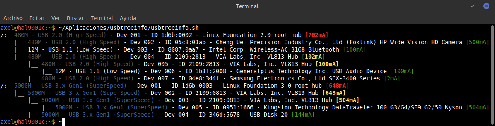
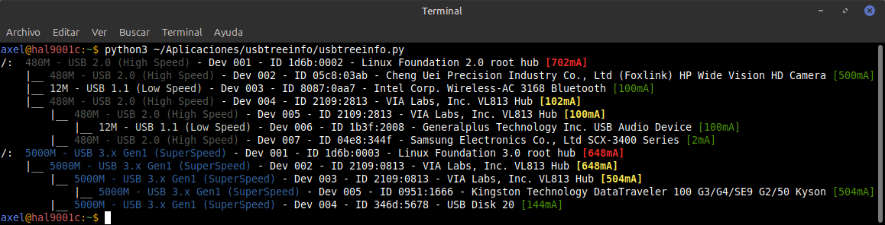

# USBTreeInfo (USB Tree Information) v7.6.20260624a




<br>

```
axel@hal9001c:~$ ~/Aplicaciones/usbtreeinfo/usbtreeinfo.sh
/:  480M - USB 2.0 (High Speed) - Dev 001 - ID 1d6b:0002 - Linux Foundation 2.0 root hub [702mA]
    |__ 480M - USB 2.0 (High Speed) - Dev 002 - ID 05c8:03ab - Cheng Uei Precision Industry Co., Ltd (Foxlink) HP Wide Vision HD Camera [500mA]
    |__ 12M - USB 1.1 (Low Speed) - Dev 003 - ID 8087:0aa7 - Intel Corp. Wireless-AC 3168 Bluetooth [100mA]
    |__ 480M - USB 2.0 (High Speed) - Dev 004 - ID 2109:2813 - VIA Labs, Inc. VL813 Hub [102mA]
        |__ 480M - USB 2.0 (High Speed) - Dev 005 - ID 2109:2813 - VIA Labs, Inc. VL813 Hub [100mA]
            |__ 12M - USB 1.1 (Low Speed) - Dev 006 - ID 1b3f:2008 - Generalplus Technology Inc. USB Audio Device [100mA]
        |__ 480M - USB 2.0 (High Speed) - Dev 007 - ID 04e8:344f - Samsung Electronics Co., Ltd SCX-3400 Series [2mA]
/:  5000M - USB 3.x Gen1 (SuperSpeed) - Dev 001 - ID 1d6b:0003 - Linux Foundation 3.0 root hub [648mA]
    |__ 5000M - USB 3.x Gen1 (SuperSpeed) - Dev 002 - ID 2109:0813 - VIA Labs, Inc. VL813 Hub [648mA]
        |__ 5000M - USB 3.x Gen1 (SuperSpeed) - Dev 003 - ID 2109:0813 - VIA Labs, Inc. VL813 Hub [504mA]
            |__ 5000M - USB 3.x Gen1 (SuperSpeed) - Dev 005 - ID 0951:1666 - Kingston Technology DataTraveler 100 G3/G4/SE9 G2/50 Kyson [504mA]
        |__ 5000M - USB 3.x Gen1 (SuperSpeed) - Dev 004 - ID 346d:5678 - USB Disk 20 [144mA]
```

<br>



<br>

```
axel@hal9001c:~$ python3 ~/Aplicaciones/usbtreeinfo/usbtreeinfo.py
/:  480M - USB 2.0 (High Speed) - Dev 001 - ID 1d6b:0002 - Linux Foundation 2.0 root hub [702mA]
    |__ 480M - USB 2.0 (High Speed) - Dev 002 - ID 05c8:03ab - Cheng Uei Precision Industry Co., Ltd (Foxlink) HP Wide Vision HD Camera [500mA]
    |__ 12M - USB 1.1 (Low Speed) - Dev 003 - ID 8087:0aa7 - Intel Corp. Wireless-AC 3168 Bluetooth [100mA]
    |__ 480M - USB 2.0 (High Speed) - Dev 004 - ID 2109:2813 - VIA Labs, Inc. VL813 Hub [102mA]
        |__ 480M - USB 2.0 (High Speed) - Dev 005 - ID 2109:2813 - VIA Labs, Inc. VL813 Hub [100mA]
            |__ 12M - USB 1.1 (Low Speed) - Dev 006 - ID 1b3f:2008 - Generalplus Technology Inc. USB Audio Device [100mA]
        |__ 480M - USB 2.0 (High Speed) - Dev 007 - ID 04e8:344f - Samsung Electronics Co., Ltd SCX-3400 Series [2mA]
/:  5000M - USB 3.x Gen1 (SuperSpeed) - Dev 001 - ID 1d6b:0003 - Linux Foundation 3.0 root hub [648mA]
    |__ 5000M - USB 3.x Gen1 (SuperSpeed) - Dev 002 - ID 2109:0813 - VIA Labs, Inc. VL813 Hub [648mA]
        |__ 5000M - USB 3.x Gen1 (SuperSpeed) - Dev 003 - ID 2109:0813 - VIA Labs, Inc. VL813 Hub [504mA]
            |__ 5000M - USB 3.x Gen1 (SuperSpeed) - Dev 005 - ID 0951:1666 - Kingston Technology DataTraveler 100 G3/G4/SE9 G2/50 Kyson [504mA]
        |__ 5000M - USB 3.x Gen1 (SuperSpeed) - Dev 004 - ID 346d:5678 - USB Disk 20 [144mA]
```

<br>

<sub>🇺🇸🇬🇧 These screenshots show the Shell (.sh) and Python (.py) versions, both producing identical output, including nested hubs and intermediate power consumption.</sub>

<sub>🇪🇸 Estas capturas muestran las versiones Shell (.sh) y Python (.py), ambas con salida idéntica, incluyendo hubs anidados y consumo de los hubs intermedios.</sub>

---
## 🇺🇸🇬🇧 English

### Description:

**USBTreeInfo** is a lightweight tool for Linux that visualizes the hierarchy of your USB ports, identifying speeds (industry-standard colors) and power consumption (mA) reported by each device. Available in two equivalent implementations: **Bash** (`usbtreeinfo.sh`) and **Python** (`usbtreeinfo.py`).

### 🆕 What's New in v7.6:

- ⚡ **Intermediate hub power consumption:** Hubs now show the recursive sum of all their connected children, not just their own declared value.
- 🏷️ **Better device names:** Names are now resolved with priority from `lsusb` output, falling back to `idVendor`/sysfs manufacturer-product when unavailable.
- 🐍 **Full Python parity:** `usbtreeinfo.py` now mirrors the Bash version feature-for-feature, including the lsusb name cache and recursive power totals.

### Features:

- 🌳 **Clean Tree:** Removes interface duplicates and hides 0mA values for better clarity.
- 🎨 **Industrial Colors:**
    | Color |
    |-------|
    | ⚪ White: USB 1.1 (Low Speed) |
    | ⚫ Grey: USB 2.0 (High Speed) |
    | 🔵 Blue: USB 3.0 / 3.1 Gen 1 (SuperSpeed) |
    | 🟢 Green: USB 3.1 Gen 2 (SuperSpeed+) |
    | 🟣 Magenta: USB 3.2 (Gen 2x2) |
    | 🔴 Red: USB4 / Thunderbolt |

- ⚡ **Power Monitor:** Displays mA per device, per intermediate hub, and total sum per Bus.

- ⚡ **Color Coding and Power Logic:** The electrical monitoring system visually distinguishes between individual, intermediate, and total consumption:

    🟢 **Green [mA]:** Individual consumption declared by an end device (e.g., a mouse, camera, or flash drive).

    🟡 **Yellow [mA]:** Consumption of an intermediate hub — the recursive sum of everything connected below it.

    🔴 **Red [mA]:** Reserved exclusively for Root Hubs (the bus root). This value is not a hardware report per se, but the total sum of all devices connected to that bus, dynamically calculated by the script.

    **Note:** If a bus or device has no active consumption [0mA], the value is omitted to avoid showing useless data.

### 🔍 Output Anatomy:

To understand what each line tells us, let's use this example from a connected device:

```shell
|__ 5000M - USB 3.x Gen1 (SuperSpeed) - Dev 005 - ID 0951:1666 - Kingston Technology DataTraveler 100 G3/G4/SE9 G2/50 Kyson [504mA]
```

| Component | Description |
|-----------|-------------|
| 5000M	| Speed: Theoretical maximum transfer rate (in this case, 5 Gbps). |
| USB 3.x Gen1 (SuperSpeed)	| Protocol: USB version and industry standard classification (SuperSpeed, High Speed, etc.). |
| Dev 005 | Device Number: Assigned by the Linux kernel on the current bus. |
| ID 0951:1666 | Vendor/Product ID: Unique identifier for the manufacturer and model. |
| Kingston Technology DataTraveler... | Description: Manufacturer name and device model. |
| [504mA] | Power: Current consumption declared by the device (or recursive total, if it's a hub). |

### Quick Installation

```bash
git clone https://github.com/LiGNUxMan/USBTreeInfo.git
cd USBTreeInfo
chmod +x usbtreeinfo.sh
```

### Usage:

```bash
# Bash version
./usbtreeinfo.sh

# Python version (equivalent output)
python3 usbtreeinfo.py
```

### Requirements

- Linux with `/sys/bus/usb/devices` available (virtually all distros).
- `lsusb` installed (package `usbutils`) for best device names.
- For the Python version: Python 3 (no third-party dependencies, stdlib only).

### Contributions
Any improvement, fix, or suggestion is welcome. Feel free to contribute to this project!

### Author
- **Axel O'BRIEN (LiGNUxMan)** - [GitHub Profile](https://github.com/LiGNUxMan/)
- **Google Antigravity** & **Claude (Anthropic)** - Development Assistance

### License
This project is distributed under the GPLv3 license. Use it, modify it, and share it freely!
- Made with 💚 and passion for Free Software.

### 🚀 Future Improvements and Features
We are looking for collaborators to keep improving USBTreeInfo. These are some ideas for future versions:

1️⃣ Per-port physical location mapping (front/back/internal headers).

**If you are interested in contributing, open an issue or make a pull request! 🤝**

---
## 🇪🇸 Español

### Descripción:

**USBTreeInfo** es una herramienta ligera para Linux que visualiza la jerarquía de tus puertos USB, identificando velocidades (colores estándar de la industria) y el consumo de energía (mA) declarado por cada dispositivo. Disponible en dos implementaciones equivalentes: **Bash** (`usbtreeinfo.sh`) y **Python** (`usbtreeinfo.py`).

### 🆕 Novedades en v7.6:

- ⚡ **Consumo de hubs intermedios:** Los hubs ahora muestran la suma recursiva de todos sus hijos conectados, no solo su propio valor declarado.
- 🏷️ **Mejores nombres de dispositivo:** Los nombres se resuelven con prioridad desde la salida de `lsusb`, cayendo a `idVendor`/manufacturer-product de sysfs cuando no está disponible.
- 🐍 **Paridad total con Python:** `usbtreeinfo.py` ahora replica función por función a la versión Bash, incluyendo la caché de nombres de lsusb y los totales recursivos de consumo.

### Características:

- 🌳 **Árbol limpio:** Elimina duplicados de interfaces y oculta valores de 0mA para mayor claridad.
- 🎨 **Colores industriales:** 
    | Color |
    |-------|
    | ⚪ Blanco: USB 1.1 (Low Speed) |
    | ⚫ Gris: USB 2.0 (High Speed) |
    | 🔵 Azul: USB 3.0 / 3.1 Gen 1 (SuperSpeed) |
    | 🟢 Verde: USB 3.1 Gen 2 (SuperSpeed+) |
    | 🟣 Magenta: USB 3.2 (Gen 2x2) |
    | 🔴 Rojo: USB4 / Thunderbolt |
  
- ⚡ **Monitor de energía:** Muestra los mA por dispositivo, por hub intermedio y el total por Bus.
- ⚡ **Código de Colores y Lógica de Energía:**
El sistema de monitoreo eléctrico diferencia visualmente entre consumo individual, intermedio y total:

    🟢 **Verde [mA]:** Consumo individual declarado por un dispositivo final (ej: un mouse, una cámara o un pendrive).

    🟡 **Amarillo [mA]:** Consumo de un hub intermedio — la suma recursiva de todo lo conectado debajo de él.

    🔴 **Rojo [mA]:** Se reserva exclusivamente para los Root Hubs (la raíz del bus). Este valor no es un reporte del hardware en sí, sino la suma total de todos los dispositivos conectados a ese bus, calculada dinámicamente por el script.

    **Nota:** Si un bus o dispositivo no tiene consumo activo [0mA], el valor se omite para no mostrar datos inútiles.

### 🔍 Anatomía de la salida:

Para entender qué nos dice cada línea, usemos este ejemplo de un dispositivo conectado:

```shell
|__ 5000M - USB 3.x Gen1 (SuperSpeed) - Dev 005 - ID 0951:1666 - Kingston Technology DataTraveler 100 G3/G4/SE9 G2/50 Kyson [504mA]
```

| Componente | Descripción  |
|------------|--------------|
| 5000M                     | Velocidad: Transferencia máxima teórica (en este caso, 5 Gbps).
| USB 3.x Gen1 (SuperSpeed) | Protocolo: Versión del USB y clasificación estándar de la industria (SuperSpeed, High Speed, etc.).
| Dev 005                   | Número de Dispositivo: Asignado por el kernel Linux en el bus actual.
| ID 0951:1666              | Vendor/Product ID: Identificador único del fabricante y el modelo.
| Kingston Technology DataTraveler... | Descripción: Nombre del fabricante y modelo del dispositivo.
| [504mA]                   | Energía: Consumo de corriente declarado por el dispositivo (o total recursivo, si es un hub).

### Instalación rápida

```bash
git clone https://github.com/LiGNUxMan/USBTreeInfo.git
cd USBTreeInfo
chmod +x usbtreeinfo.sh
```

### Uso:

```bash
# Versión Bash
./usbtreeinfo.sh

# Versión Python (salida equivalente)
python3 usbtreeinfo.py
```

### Requisitos

- Linux con `/sys/bus/usb/devices` disponible (prácticamente todas las distros).
- `lsusb` instalado (paquete `usbutils`) para obtener los mejores nombres de dispositivo.
- Para la versión Python: Python 3 (sin dependencias de terceros, solo stdlib).

### Contribuciones
Cualquier mejora, corrección o sugerencia es bienvenida. ¡Suma tu aporte a este proyecto!

### Autor
- **Axel O'BRIEN (LiGNUxMan)** - [GitHub Profile](https://github.com/LiGNUxMan/)
- **Google Antigravity** y **Claude (Anthropic)** - Asistencia en desarrollo

### Licencia
Este proyecto se distribuye bajo la licencia **GPLv3**. ¡Úsalo, modifícalo y compártelo libremente!
- Hecho con 💚 y pasión por el software libre.

### 🚀 Mejoras y funcionalidades futuras
Estamos buscando colaboradores para seguir mejorando USBTreeInfo. Estas son algunas ideas para futuras versiones:

1️⃣ Mapeo de ubicación física por puerto (frontal/trasero/headers internos).

**Si te interesa contribuir, ¡abre un issue o haz un pull request! 🤝**
